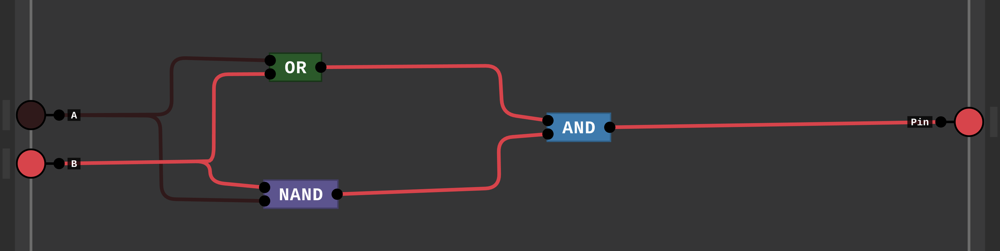
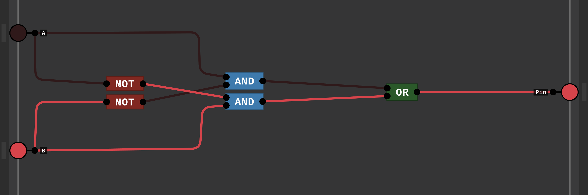

# Week 6 Exercises

1. In addition to the basic laws we discussed in this section, there are two important theorems, called DeMorgan's theorems. Prove DeMorgan's theorems with a truth table of the form
  -  The two De Morgan's theorems are:
   1. The complement of the union of two sets is equal to the intersection of their complements:
```
~(A OR B) = ~A AND ~B

```
   2. The complement of the intersection of two sets is equal to the union of their complements:
```
~(A OR B) = ~A AND ~B
```

| A   | B   | A OR B | ~A  | ~B  | ~A AND ~B | ~(A AND B) |
|-----|-----|--------|-----|-----|-----------|------------|
| 0   | 0   | 0      | 1   | 1   | 1         | 1          |
| 0   | 1   | 1      | 1   | 0   | 0         | 0          |
| 1   | 0   | 1      | 0   | 1   | 0         | 0          |
| 1   | 1   | 1      | 0   | 0   | 0         | 0          |


| A   | B   | A OR B | ~A  | ~B  | ~A AND ~B | ~(A AND B) |
|-----|-----|--------|-----|-----|-----------|------------|
| 0   | 0   | 0      | 1   | 1   | 1         | 1          |
| 0   | 1   | 0      | 1   | 0   | 1         | 1          |
| 1   | 0   | 0      | 0   | 1   | 1         | 1          |
| 1   | 1   | 1      | 0   | 0   | 0         | 0          |

---
2. One logic function that is used for a variety of purposes (including within adders and to compute parity) is exclusive OR. The output of a two-input exclusive OR function is true only if exactly one of the inputs is true. Show the truth table for a two-input exclusive OR function and implement this function using AND gates, OR gates, and inverters.

| A   | B   | XOR |
|-----|-----|-----|
| 0   | 0   | 0   |
| 0   | 1   | 1   |
| 1   | 0   | 1   |
| 1   | 1   | 0   |


```
XOR = (A AND ~B) OR (~A AND B)
```




---
3. Assume that X consists of 3 bits, x2 x1 x0. Write four logic functions that are true if and only if

- X contains only one 0
```
f(X) = (x2 AND x1 AND ~x0) OR (x2 AND ~x1 AND x0) OR (~x2 AND x1 AND x0)
f(X) = (x2 AND ~x1 AND ~x0) OR (~x2 AND x1 AND ~x0) OR (~x2 AND ~x1 AND x0)
```
- X contains an even number of 0s
```
f(X) = (x2 AND ~x1 AND ~x0) OR (~x2 AND ~x1 AND x0) OR (~x2 AND x1 AND ~x0) OR (~x2 AND ~x1 AND ~x0)
```
- X when interpreted as an unsigned binary number is less than 4
```
f(X) = ~x2 AND ~x1 AND x0
```

- X when interpreted as a signed (two's complement) number is negative
```
f(X) = x2 AND ~x1 AND ~x0
```

---
4. Assume that X consists of 3 bits, x2 x1 x0, and Y consists of 3 bits, y2 y1 y0. Write logic functions that are true if and only if

- X < Y, where X and Y are thought of as unsigned binary numbers
```
f(X, Y) = (~x2 AND y2) OR ((~x2 AND ~y2) AND (x1 AND ~y1 AND (x0 AND ~y0)))
f(X, Y) = (x2 AND ~y2) OR ((x2 = y2) AND ((x1 AND ~y1) OR ((x1 = y1) AND (x0 AND ~y0))))
```
- X < Y, where X and Y are thought of as signed (two's complement) numbers
```
f(X, Y) = (x2 AND ~y2) OR ((x2 AND y2) AND (x1 < y1 OR (x1 = y1 AND x0 < y0)))
```
- X = Y
```
f(X, Y) = (x2 = y2) AND (x1 = y1) AND (x0 = y0)
```

5. Use a hierarchical approach that can be extended to larger numbers of bits. Show how can you extend it to 6-bit comparison.


---
6. Show a truth table for a multiplexor (inputs A, B, and S; output C), using don't cares to simplify the table where possible.
   

