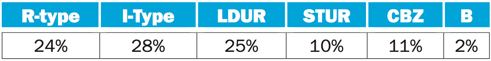

# Week 7 Exercises

1. Consider the following instruction:
    Instruction: AND Rd, Rn, Rm
    Interpretation: Reg[Rd] = Reg[Rn] AND Reg[Rm]
    - (a) What are the values of control signals generated by the control in COD Figure 4.10 (The datapath for the memory instructions and the R-type instructions) for this instruction?
    - (b) Which resources (blocks) perform a useful function for this instruction?
    - (c) Which resources (blocks) produce no output for this instruction? Which resources produce output that is not used

---

2. Consider the following instruction mix:
    
    Table depicting percentage for R-type, I-type, LDUR, STUR, CBZ, and B instructions. R-type are 24 percent. I-Type are 28 percent. LDUR are 25 percent. STUR are 10 percent. CBZ are 11 percent. B are 2 percent.
    - (a) What fraction of all instructions use data memory?
    - (b) What fraction of all instructions use instruction memory?
    - (c) What fraction of all instructions use the sign extend?
    - (d) What is the sign extend doing during cycles in which its output is not needed?

---

3. When silicon chips are fabricated, defects in materials (e.g., silicon) and manufacturing errors can result in defective circuits. A very common defect is for one signal wire to get "broken" and always register a logical 0. This is often called a "stuck-at-0" fault.
    - (a) Which instructions fail to operate correctly if the MemtoReg wire is stuck at 0?
    - (b) Which instructions fail to operate correctly if the ALUSrc wire is stuck at 0?
    - (c) Which instructions fail to operate correctly if the Reg2Loc wire is stuck at 0?

---

4. What is the minimum number of cycles needed to completely execute n instructions on a CPU with a k stage pipeline? Justify your formula.

---

5. Add NOP instructions to the code below so that it will run correctly on a pipeline that does not handle data hazards.
```arm
    ADDI X1, X2, #5 
    ADD X3, X1, X2 
    ADDI X4, X1, #15 
    ADD X5, X3, X2
```
