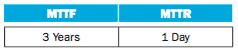

# Week 9 Exercises 

1. In this exercise we look at memory locality properties of matrix computation. The following code is written in C, where elements within the same row are stored contiguously. Assume each word is a 64-bit integer.
```c
for (I = 0; I < 8; I++)
    for (J = 0; J < 8000; J++)
        A[I][J] = B[I][0] + A[J][I];
```

- a) How many 64-bit integers can be stored in a 16-byte cache block?
There are 2^4 = 16 bytes in a cache block, and each 64-bit integer requires 8 bytes. Therefore, a cache block can store 16/8 = 2 64-bit integers.
- b) Which variable references exhibit temporal locality?
Variables I, J, and B[I][0]
- c) Which variable references exhibit spatial locality?
Variables A[I][J] and A[J][I]
- d) Locality is affected by both the reference order and data layout. The same computation can also be written below in Matlab, which differs from C in that it stores matrix elements within the same column contiguously in memory.

```matlab
for I = 1:8
    for J = 1:8000
        A(I,J) = B(I,0) + A(J,I);
    end
end
```
- e) Which variable references exhibit temporal locality?
In the Matlab code, variable I, J, and B(I,0) exhibit temporal locality
- f) Which variable references exhibit spatial locality?
Variable A(I,J),  A(J,I) and B(I,0)
- g) How many 16-byte cache blocks are needed to store all 64-bit matrix elements being referenced using Matlab's matrix storage? How many using C's matrix storage? (Assume each row contains more than one element.)
  8 × 8000/4 × 2 – 8 × 8/4 + 8000/4 = 33984 
  8 × 8000/4 × 2 – 8 × 8/4 + 8/4 = 31986
---
2. Caches are important to providing a high-performance memory hierarchy to processors. Below is a list of 64-bit memory address references, given as word addresses.

```
0x03, 0xb4, 0x2b, 0x02, 0xbf, 0x58, 0xbe, 0x0e, 0xb5, 0x2c, 0xba, 0xfd
```

- a) For each of these references, identify the binary word address, the tag, and the index given a direct-mapped cache with 16 one-word blocks. Also list whether each reference is a hit or a miss, assuming the cache is initially empty.

| Hex Reference | Binary Reference | Tag | Index  | Hit/ Miss |
|---------------|------------------|-----|--------|-----------|
| 0x03          | 0b000000000011   | 0   | 0b0011 | M         |
| 0xb4          | 0b000010110100   | b   | 0b0100 | M         |
| 0x2b          | 0b000000101011   | 2   | 0b1011 | M         |
| 0x02          | 0b000000000010   | 0   | 0b0010 | M         |
| 0xbf          | 0b000010111111   | b   | 0b1111 | M         |
| 0x58          | 0b000001011000   | 5   | 0b1000 | M         |
| 0xbe          | 0b000010111110   | b   | 0b1110 | M         |
| 0x0e          | 0b000000001110   | 0   | 0b1110 | M         |
| 0xb5          | 0b000010110101   | b   | 0b0101 | M         |
| 0x2c          | 0b000000101100   | 2   | 0b1100 | M         |
| 0xba          | 0b000010111010   | b   | 0b1010 | M         |
| 0xfd          | 0b000011111101   | f   | 0b1101 | M         |
- b) For each of these references, identify the binary word address, the tag, the index, and the offset given a direct-mapped cache with two-word blocks and a total size of eight blocks. Also list if each reference is a hit or a miss, assuming the cache is initially empty.

| Hex Reference | Binary Reference | Tag | Index  | Offset | Hit/ Miss |
|---------------|------------------|-----|--------|--------|-----------|
| 0x03          | 0b000000000011   | 0   | 0b0011 | 1      | M         |
| 0xb4          | 0b000010110100   | b   | 0b0100 | 0      | M         |
| 0x2b          | 0b000000101011   | 2   | 0b1011 | 1      | M         |
| 0x02          | 0b000000000010   | 0   | 0b0010 | 0      | H         |
| 0xbf          | 0b000010111111   | b   | 0b1111 | 1      | M         |
| 0x58          | 0b000001011000   | 5   | 0b1000 | 0      | M         |
| 0xbe          | 0b000010111110   | b   | 0b1110 | 0      | M         |
| 0x0e          | 0b000000001110   | 0   | 0b1110 | 0      | M         |
| 0xb5          | 0b000010110101   | b   | 0b0101 | 1      | M         |
| 0x2c          | 0b000000101100   | 2   | 0b1100 | 0      | M         |
| 0xba          | 0b000010111010   | b   | 0b1010 | 0      | M         |
| 0xfd          | 0b000011111101   | f   | 0b1101 | 1      | M         |

- c) You are asked to optimize a cache design for the given references. There are three direct-mapped cache designs possible, all with a total of eight words of data: C1 has 1-word blocks, C2 has 2-word blocks, and C3 has 4-word blocks. In terms of miss rate, which cache design is the best? If the miss stall time is 25 cycles, and C1 has an access time of 2 cycles, C2 takes 3 cycles, and C3 takes 5 cycles, which is the best cache design?

There are many different design parameters that are important to a cache's overall performance. Below are listed parameters for different direct-mapped cache designs.

- **Cache Data Size:** 32 KiB
- **Cache Block Size:** 2 words
- **Cache Access Time:** 1 cycle

For C1, the hit time is 1 cycle since there is only one word per block, but the miss penalty is 25 cycles. Therefore, the average access time can be calculated as: hit time + (miss rate * miss penalty) = 1 + (1.0 * 25) = 26 cycles.

For C2, the hit time is 1 cycle since there are two words per block, but the miss penalty is 25 cycles. Therefore, the average access time can be calculated as: hit time + (miss rate * miss penalty) = 1 + (0.5 * 25) = 13.5 cycles.

For C3, the hit time is 1 cycle since there are four words per block, but the miss penalty is 25 cycles. Therefore, the average access time can be calculated as: hit time + (miss rate * miss penalty) = 1 + (0.75 * 25) = 19.75 cycles.

Therefore, C2 is the best cache design in terms of overall access time, with an average access time of 13.5 cycles.

---

3. Media applications that play audio or video files are part of a class of workloads called "streaming" workloads i.e., they bring in large amounts of data but do not reuse much of it. Consider a video streaming workload that accesses a 512 KiB working set sequentially with the following address stream:

```
0, 1, 2, 3, 4, 5, 6, 7, 8, 9 …
```

- a) Assume a 64 KiB direct-mapped cache with a 32-byte block. What is the miss rate for the address stream above? How is this miss rate sensitive to the size of the cache or the working set? How would you categorize the misses this workload is experiencing, based on the 3C model?

- b) Re-compute the miss rate when the cache block size is 16 bytes, 64 bytes, and 128 bytes. What kind of locality is this workload exploiting?

- c) "Prefetching" is a technique that leverages predictable address patterns to speculatively bring in additional cache blocks when a particular cache block is accessed. One example of prefetching is a stream buffer that prefetches sequentially adjacent cache blocks into a separate buffer when a particular cache block is brought in. If the data are found in the prefetch buffer, it is considered as a hit, moved into the cache, and the next cache block is prefetched. Assume a two-entry stream buffer; and, assume that the cache latency is such that a cache block can be loaded before the computation on the previous cache block is completed. What is the miss rate for the address stream above?

---

4. Mean time between failures (MTBF), mean time to replacement (MTTR), and mean time to failure (MTTF) are useful metrics for evaluating the reliability and availability of a storage resource. Explore these concepts by answering the questions about a device with the following metrics: 


5. 
- a) Calculate the MTBF for such a device.

- b) Calculate the availability for such a device.

- c) What happens to availability as the MTTR approaches 0? Is this a realistic situation?

- d) What happens to availability as the MTTR gets very high, i.e., a device is difficult to repair? Does this imply the device has low availability?

---

5. There are several parameters that impact the overall size of the page table. Listed below are key page table parameters.


- (a) Given the parameters shown above, calculate the total page table size for a system running 5 applications that utilize half of the memory available.

- (b) Given the parameters shown above, calculate the total page table size for a system running 5 applications that utilize half of the virtual memory available, given a two level page table approach with up to 256 entries at the first level. Assume each entry of the main page table is 6 bytes. Calculate the minimum and maximum amount of memory required for this page table.

- (c) A cache designer wants to increase the size of a 4 KiB virtually indexed, physically tagged cache. Given the page size shown above, is it possible to make a 16 KiB direct-mapped cache, assuming four 32-bit words per block? How would the designer increase the data size of the cache?

---

6. Compare and contrast the ideas of virtual memory and virtual machines. How do the goals of each compare? What are the pros and cons of each? List a few cases where virtual memory is desired, and a few cases where virtual machines are desired.