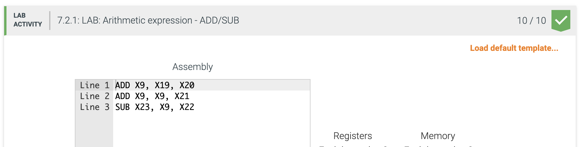
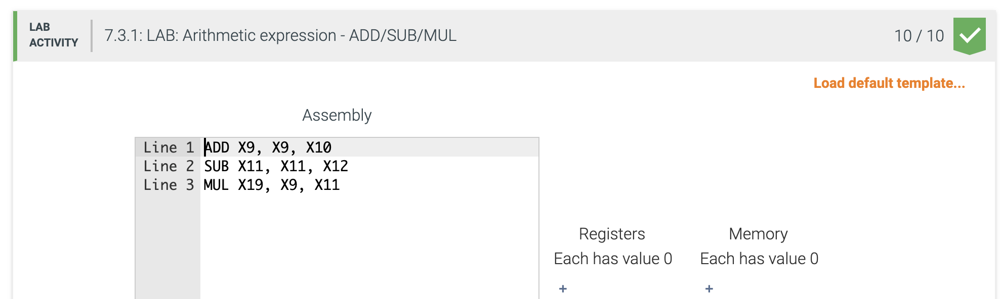
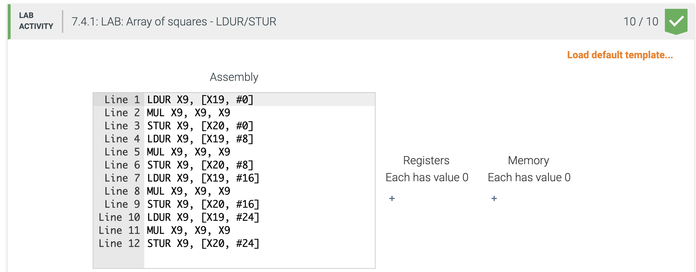
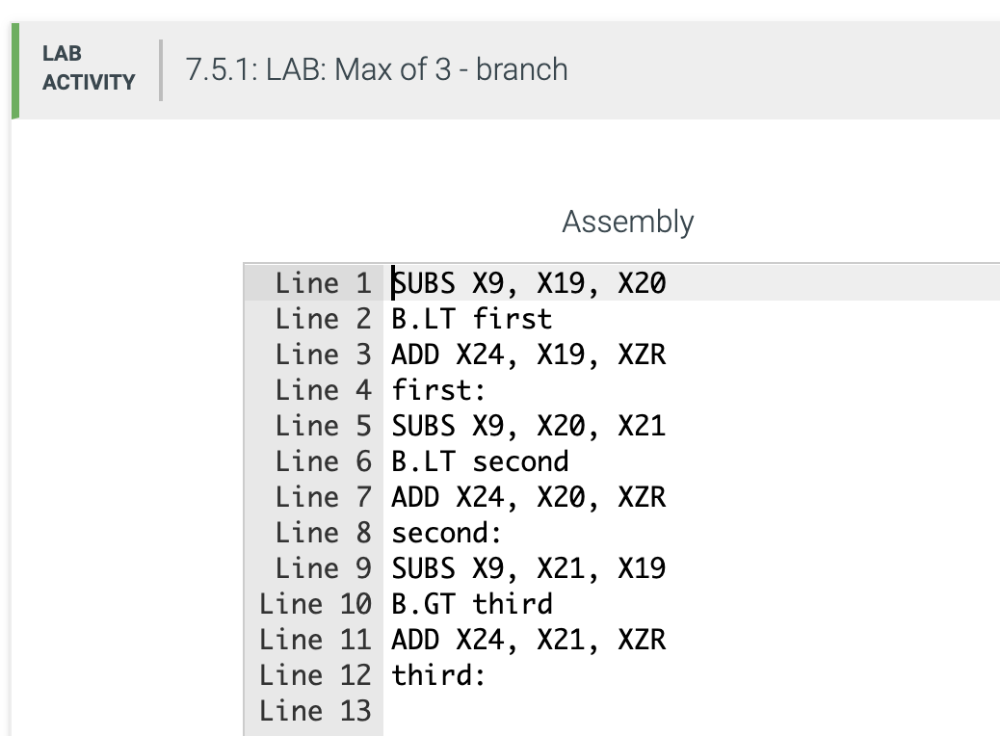
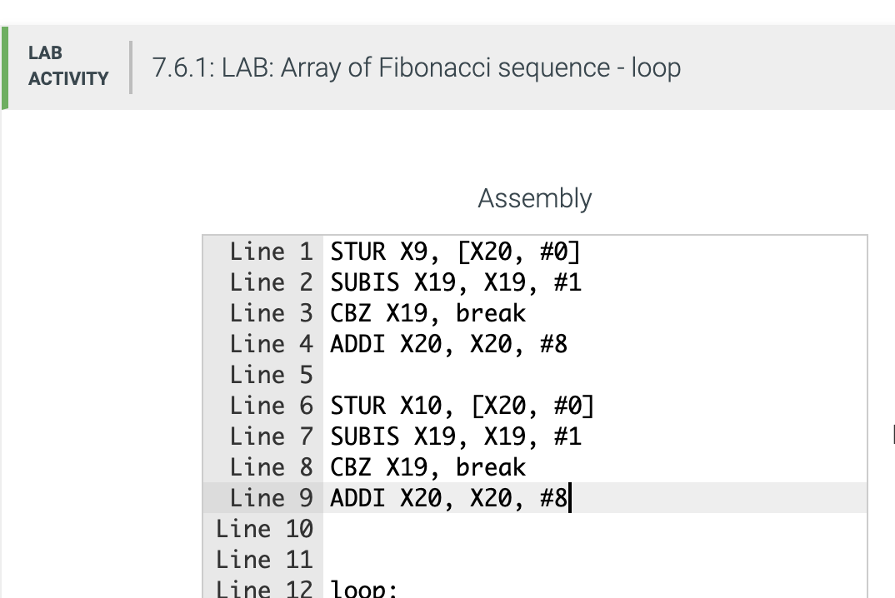
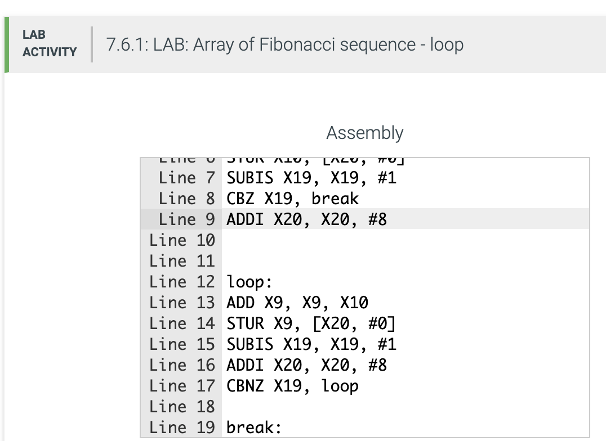
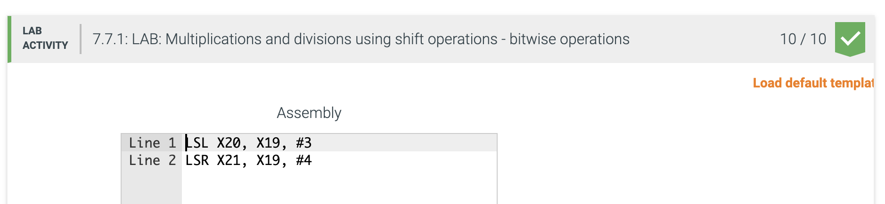
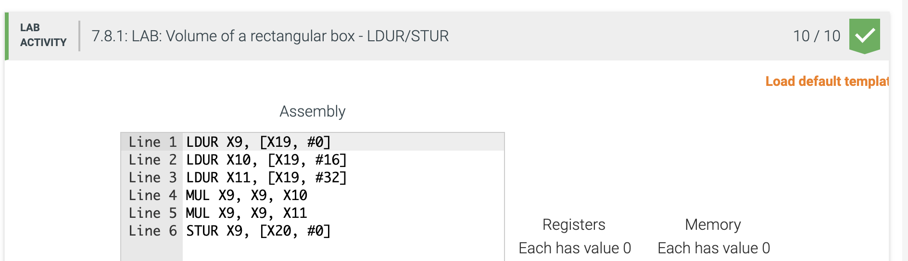
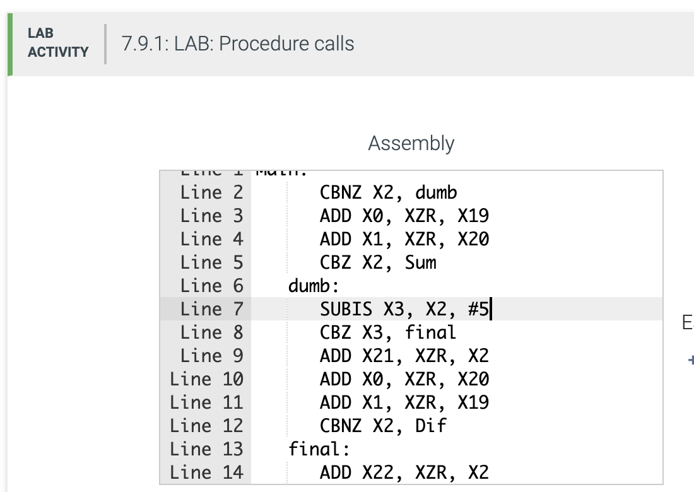

# Arm Labs
These labs were done originally on the [Zybooks](learn.zybooks.com) platform using a dumbed down version of ARMv8 called LEGv8. I would not recommend this platform as many of the operations that were said to work did not actually work for some reason. The error codes were also incredibly unclear. The automatic grading would  often quit after only running few tests, giving only partial credit.

# 7.2
```ARMv8
    ADD X9, X19, X20
    ADD X9, X9, X21
    SUB X23, X9, X22
```


# 7.3
```LEGv8
    ADD X9, X9, X10
    SUB X11, X11, X12
    MUL X19, X9, X11
```


# 7.4
```Legv8
    LDUR X9, [X19, #0]
    MUL X9, X9, X9
    STUR X9, [X20, #0]
    LDUR X9, [X19, #8]
    MUL X9, X9, X9
    STUR X9, [X20, #8]
    LDUR X9, [X19, #16]
    MUL X9, X9, X9
    STUR X9, [X20, #16]
    LDUR X9, [X19, #24]
    MUL X9, X9, X9
    STUR X9, [X20, #24]

```


# 7.5
```LEGv8
    SUBS X9, X19, X20
    B.LT first
    ADD X24, X19, XZR
    first:
    SUBS X9, X20, X21
    B.LT second
    ADD X24, X20, XZR
    second:
    SUBS X9, X21, X19
    B.GT third
    ADD X24, X21, XZR
    third:
```


# 7.6
```LEGv8
    STUR X9, [X20, #0]
    SUBIS X19, X19, #1 
    CBZ X19, break
    ADDI X20, X20, #8
    
    STUR X10, [X20, #0]
    SUBIS X19, X19, #1 
    CBZ X19, break
    ADDI X20, X20, #8
    
    
    loop:
    ADD X9, X9, X10
    STUR X9, [X20, #0]
    SUBIS X19, X19, #1 
    ADDI X20, X20, #8
    CBNZ X19, loop
    
    break:
```



# 7.7
```LEGv8
    LSL X20, X19, #3
    LSR X21, X19, #4
```



# 7.8
```LEGv8
    LDUR X9, [X19, #0]
    LDUR X10, [X19, #16]
    LDUR X11, [X19, #32]
    MUL X9, X9, X10
    MUL X9, X9, X11
    STUR X9, [X20, #0]
```


# 7.9
```LEGv8
    Main:
          CBNZ X2, dumb
          ADD X0, XZR, X19
          ADD X1, XZR, X20
          CBZ X2, Sum
       dumb:
          SUBIS X3, X2, #5
          CBZ X3, final
          ADD X21, XZR, X2
          ADD X0, XZR, X20
          ADD X1, XZR, X19
          CBNZ X2, Dif
       final:
          ADD X22, XZR, X2
    
          B End
    
    // Procedure Sum (Do not modify)
    Sum:
          ADD X2, X0, X1
          BR X30
    
    // Procedure Dif (Do not modify)
    Dif:
          SUB X2, X0, X1
          BR X30
    
    End:
```

