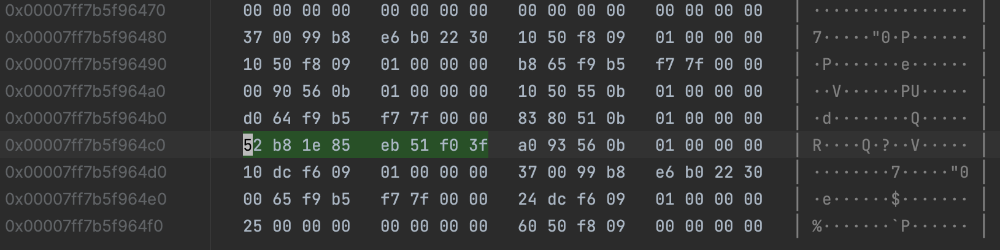
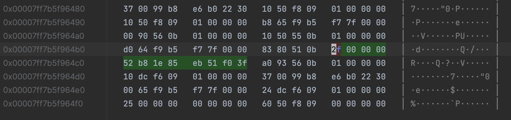
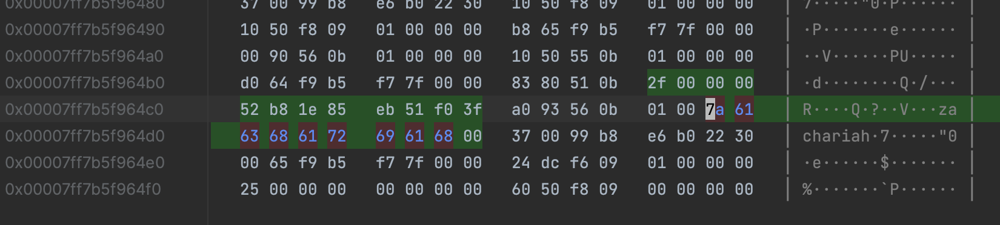
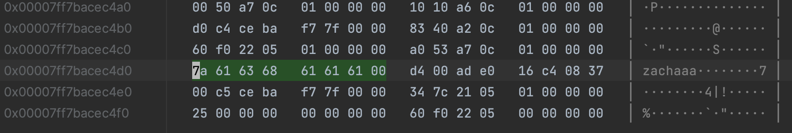
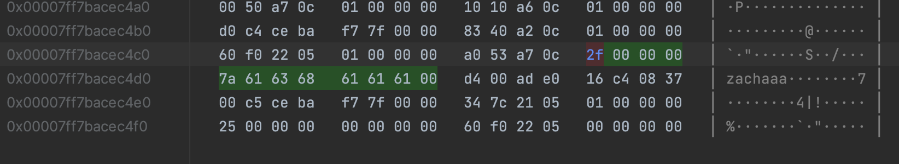
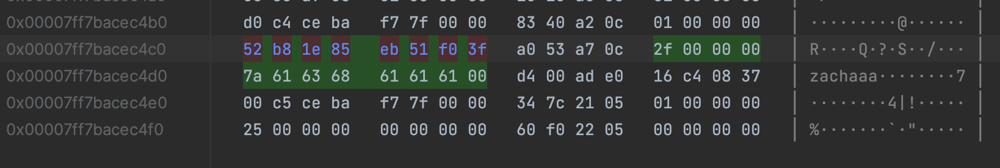

# Lab 1 Intro to C/C++
### Overview
We are going to learn the basics (and a few advanced features) of C / C++. C is not used very often these days to write programs, as such, it is likely better for your career to learn c++.

The basics of these languages do not differ much from Java or other languages you may have encounter, as most modern languages are considered c-style languages.
So, we are going to cruise through the basic features of the language and focus on the things that make C /C++ unique: pointers.

This is a really great resource for learning C and C++:
- [learn-c](https://www.learn-c.org/en/WelcomeLinks) to an external site.
- [learn-c++](https://www.learn-cpp.org/Links) to an external site.

Be sure you have the gcc compiler installed on your computer to run these programs.

### Lab Assignment
Each program should be written in a different file (or for extra credit, make a console menu so I can run each program from one executable.)

- Write a program that will compute the area of a circle. The program should prompt for the radius of the circle. It should then display the result.
```c++
void AreaOfACircle() {
    double radius, area;
    cout << "Enter the radius of the circle: ";
    cin  >> radius;
    while(!cin) // or if(cin.fail())
    {   // user didn't input a number
        cin.clear(); // reset failbit
        cin.ignore(std::numeric_limits<std::streamsize>::max(), '\n');
        cout << "Please input a number for the radius of the circle: ";
        cin >> radius;
    }
    area = M_PI * pow(radius, 2);
    cout << "The area of the circle is: " << area << endl;
}
```
- Write another version of the first program. Write a program that will compute the area of a circle. The program should prompt for the radius of the circle and the precision of the answer.  It should then display the result.  You will likely want to switch data types.You will need a highly precise version of pi. 3.141592653589793238 may work.

- Write a program that checks if a 'job candidate' meets the qualifications for the job. The job qualification is they have a bachelor or masters degree, speaks French and English, and has more than 3 years of job experience but less than 10. The user will be prompted to enter answers to each question and then the program should output whether or not the user is qualified for the job. Make a variable called degree thats is an enumeration type AcademicDegree(possible values: none, associate, bachelor, master, doctor, professional). Checks language with speaksFrench and speaksEnglish booleans. If the user enters invalid values, they should immediately be disqualified.

- Write a program that writes the numbers 1 to an arbitrary limit determined by a user. The program should write the numbers in rows of 10 numbers each, 1 number per column. Do not include numbers that are multiples of 6 or are multiples of 17.

- Write a program that reads an array size from the keyboard and dynamically allocates an array of that size for floating-point values. Using pointer notation, initialize all the elements of the array so that the value is the index position n, 1/(n+1)^2. Calculate the sum of the elements using array notation, and then output the square root of that sum.
- Write a short program in c and declare a double, an int and a string. Your program should then print the address and value of all three variables.
  - Draw a small memory diagram showing the location of each of the variables in your program. Are they allocated in the same order that you declared them? Is there any empty space between them?
    
    
    
  - Modify your program by rearranging the variable declarations and/or changing the length of the string. (In particular, try a string that uses 5 or 7 bytes, including the null terminator.) Does this change the results you got previously?
    
    
    
  - 
- Write a function that accepts two variables (by value) of the same data type of your choice (e.g. int or double) and tries to swap their values.  Then call your function in a main function.  Does your function work as you expected? Can you modify the function to work as you expected?

- Write a program that dynamically allocates a chunk of memory large enough to store 6 integers. Then prompt the user the enter 6 integers and store them in your newly-allocated memory. Finally, print the integer values in reverse order. (Recall from part c that the close correspondence between pointers and arrays in C. This correspondence allows you to treat the pointer returned by malloc as the name of a 6-element int array.) Remember to free the memory you allocated?